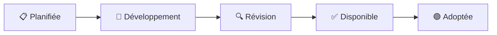

# 🔴 Directives fondamentales - GlobalAI-Directive

Les **directives fondamentales** constituent le socle éthique et technique pour tous les systèmes d'intelligence artificielle. Elles définissent les principes universels qui doivent être respectés indépendamment du secteur d'application ou de la technologie utilisée.

## 📋 Vue d'ensemble

### 🎯 Objectif des directives fondamentales

Ces directives établissent les **standards minimaux** que tout système IA doit respecter pour être considéré comme éthique et responsable. Elles servent de **fondation** pour toutes les autres directives sectorielles et techniques.

### 🏗️ Architecture des directives

```
Directives Fondamentales (5)
├── D001 - Transparence et explicabilité     ✅ Disponible
├── D002 - Protection des données           ✅ Disponible  
├── D003 - Non-discrimination et équité     ✅ Disponible
├── D004 - Sécurité et robustesse          ✅ Disponible
└── D005 - Responsabilité et gouvernance    ✅ Disponible
```

## 📚 Directives disponibles

### ✅ D001 - Transparence et explicabilité
**[📖 Lire la directive complète](D001-transparency-explainability.md)**

**Résumé** : Établit les exigences de transparence et d'explicabilité pour tous les systèmes IA, garantissant que les utilisateurs comprennent comment les décisions sont prises.

**Points clés** :
- Obligation d'informer sur l'usage d'IA
- Exigences d'explication pour les décisions critiques
- Documentation technique complète requise
- Logging et traçabilité des décisions
- Métriques de performance transparentes

**Secteurs prioritaires** : Santé, Finance, Justice, RH
**Impact** : Fondamental - Applicable à tous les systèmes IA

---

### ✅ D002 - Protection des données personnelles
**[📖 Lire la directive complète](D002-data-protection.md)**

**Résumé** : Établit les exigences strictes de protection des données personnelles pour tous les systèmes IA, garantissant la conformité RGPD et les meilleures pratiques de gouvernance des données.

**Points clés** :
- Privacy by Design et Privacy by Default obligatoires
- Consentement libre, spécifique, éclairé et univoque
- Minimisation et pseudonymisation des données
- Exercice effectif des droits des personnes concernées
- Techniques de privacy-preserving machine learning

**Secteurs prioritaires** : Tous secteurs traitant données personnelles
**Impact** : Fondamental - Conformité légale obligatoire

---

### ✅ D003 - Non-discrimination et équité
**[📖 Lire la directive complète](D003-non-discrimination-fairness.md)**

**Résumé** : Définit les exigences fondamentales d'équité et de non-discrimination pour éliminer les biais algorithmiques et garantir l'égalité de traitement.

**Points clés** :
- Tests de détection des biais avant déploiement
- Métriques d'équité détaillées par groupe démographique
- Datasets d'entraînement représentatifs et diversifiés
- Mécanismes de correction des biais identifiés
- Processus de contestation et recours

**Secteurs prioritaires** : RH, Finance, Justice, Santé
**Impact** : Critique - Prévention discriminations systémiques

---

### ✅ D004 - Sécurité et robustesse
**[📖 Lire la directive complète](D004-security-robustness.md)**

**Résumé** : Assure la sécurité, fiabilité et résistance des systèmes IA face aux menaces, attaques et défaillances.

**Points clés** :
- Détection et protection contre attaques adversariales
- Tests de robustesse obligatoires avant déploiement
- Monitoring continu de la dérive des modèles
- Mécanismes failsafe pour cas critiques
- Plans de continuité et récupération après incident

**Secteurs prioritaires** : Santé, Finance, Transport, Sécurité
**Impact** : Critique - Sécurité utilisateurs et continuité service

---

### ✅ D005 - Responsabilité et gouvernance
**[📖 Lire la directive complète](D005-responsibility-governance.md)**

**Résumé** : Établit les structures organisationnelles, rôles et processus nécessaires pour une gouvernance éthique et responsable de l'IA.

**Points clés** :
- Désignation responsable IA avec autorité décisionnelle
- Comité de gouvernance IA multidisciplinaire
- Processus formels validation et approbation
- Registre complet des systèmes IA déployés
- Mécanismes supervision humaine et gestion incidents

**Secteurs prioritaires** : Toutes organisations utilisant l'IA
**Impact** : Fondamental - Structure organisationnelle responsable

## 🎯 Statuts des directives

### Légende des statuts

| Statut | Icône | Description |
|--------|-------|-------------|
| **Disponible** | ✅ | Directive complète, révisée et prête à l'implémentation |
| **En développement** | 🔄 | Directive en cours de rédaction, contributions ouvertes |
| **Planifiée** | 📋 | Directive identifiée, développement à venir |
| **En révision** | 🔍 | Directive en cours d'examen communautaire |
| **Adoptée** | 🟢 | Directive officiellement validée par la communauté |

### Processus de développement



## 🤝 Comment contribuer

### 📝 Révision de D001

La directive **D001 - Transparence et explicabilité** est maintenant disponible pour révision communautaire. Vos retours sont précieux :

- **[💬 Discussion GitHub](https://github.com/global-ai-trust-fondation/GlobalAI-Directive/discussions)** - Débat ouvert
- **[📋 Issues](https://github.com/global-ai-trust-fondation/GlobalAI-Directive/issues)** - Signaler des problèmes spécifiques
- **[🔧 Pull Requests](https://github.com/global-ai-trust-fondation/GlobalAI-Directive/pulls)** - Proposer des améliorations

### 🚀 Contribuer aux prochaines directives

Vous pouvez contribuer au développement des directives D002-D005 :

1. **Expertise sectorielle** : Partager votre expérience terrain
2. **Recherche académique** : Apporter des références et études
3. **Retours d'implémentation** : Expérience pratique des standards
4. **Révision technique** : Validation de la faisabilité

### 📋 Templates et ressources

- **[Template de directive](../TEMPLATE.md)** - Structure standardisée
- **[Guide de contribution](../../CONTRIBUTING.md)** - Processus détaillé
- **[Checklist qualité](../quality-checklist.md)** - Critères de validation

## 📊 Métriques d'adoption

### Objectifs 2025

- **D001** : 10+ organisations pilotes d'ici mars 2025
- **D002-D005** : Versions beta disponibles d'ici juin 2025
- **Certifications** : Premier programme de certification lancé Q4 2025

### Indicateurs de succès

- Nombre d'organisations adoptantes
- Retours d'implémentation positifs
- Conformité réglementaire facilitée
- Reconnaissance institutionnelle

## 📚 Ressources complémentaires

### Documentation technique
- **[Guide d'implémentation D001](../guides/D001-implementation-guide.md)** - À créer
- **[Outils d'audit](../tools/)** - Scripts et templates
- **[Exemples de code](../examples/)** - Implémentations de référence

### Formation et certification
- **[Cours en ligne](https://training.globalaitrust.org)** - À développer
- **[Webinaires](https://events.globalaitrust.org)** - Sessions communautaires
- **[Certification professionnelle](https://cert.globalaitrust.org)** - Programme à venir

---

## 🔄 Feuille de route 2025

### Q1 2025 (Janvier-Mars)
- [x] D001 : Version initiale disponible
- [ ] D001 : Révision communautaire (30 jours)
- [ ] D002 : Début du développement
- [ ] Première organisation pilote D001

### Q2 2025 (Avril-Juin)
- [ ] D001 : Version finale adoptée
- [ ] D002 : Version beta disponible
- [ ] D003 : Début du développement
- [ ] 5+ organisations pilotes

### Q3 2025 (Juillet-Septembre)
- [ ] D002-D003 : Versions finales
- [ ] D004-D005 : Versions beta
- [ ] Première certification délivrée
- [ ] 20+ organisations adoptantes

### Q4 2025 (Octobre-Décembre)
- [ ] Toutes les directives fondamentales adoptées
- [ ] Programme de certification opérationnel
- [ ] 50+ organisations dans l'écosystème
- [ ] Reconnaissance institutionnelle

---

*Les directives fondamentales sont le cœur de GlobalAI-Directive. Elles évoluent grâce à votre participation active !*

**Dernière mise à jour** : 30 janvier 2025  
**Prochaine révision** : 30 avril 2025