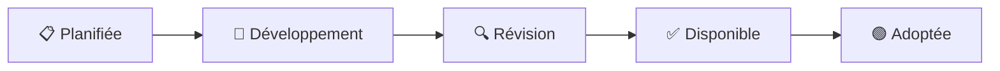

# 🔴 Directives fondamentales - GlobalAI-Directive

Les **directives fondamentales** constituent le socle éthique et technique pour tous les systèmes d'intelligence artificielle. Elles définissent les principes universels qui doivent être respectés indépendamment du secteur d'application ou de la technologie utilisée.

## 📋 Vue d'ensemble

### 🎯 Objectif des directives fondamentales

Ces directives établissent les **standards minimaux** que tout système IA doit respecter pour être considéré comme éthique et responsable. Elles servent de **fondation** pour toutes les autres directives sectorielles et techniques.

### 🏗️ Architecture des directives

```
Directives Fondamentales (5)
├── D001 - Transparence et explicabilité     ✅ Disponible
├── D002 - Protection des données           🔄 En développement  
├── D003 - Non-discrimination et équité     📋 Planifiée
├── D004 - Sécurité et robustesse          📋 Planifiée
└── D005 - Responsabilité et gouvernance    📋 Planifiée
```

## 📚 Directives disponibles

### ✅ D001 - Transparence et explicabilité
**[📖 Lire la directive complète](D001-transparency-explainability.md)**

**Résumé** : Établit les exigences de transparence et d'explicabilité pour tous les systèmes IA, garantissant que les utilisateurs comprennent comment les décisions sont prises.

**Points clés** :
- Obligation d'informer sur l'usage d'IA
- Exigences d'explication pour les décisions critiques
- Documentation technique complète requise
- Logging et traçabilité des décisions
- Métriques de performance transparentes

**Secteurs prioritaires** : Santé, Finance, Justice, RH
**Impact** : Fondamental - Applicable à tous les systèmes IA

---

### 🔄 D002 - Protection des données personnelles
**[📋 En cours de développement]**

**Objectif** : Définir les standards de protection, minimisation et gouvernance des données personnelles utilisées par les systèmes IA.

**Points clés prévus** :
- Principes de minimisation des données
- Consentement éclairé et granulaire
- Sécurisation des données d'entraînement
- Droit à l'oubli et portabilité
- Audit des flux de données

**Date de livraison prévue** : Février 2025

---

### 📋 D003 - Non-discrimination et équité
**[🗓️ Planifiée]**

**Objectif** : Prévenir les biais algorithmiques et garantir l'équité des systèmes IA envers tous les groupes de population.

**Points clés prévus** :
- Détection et mesure des biais
- Tests d'équité standardisés
- Correction des biais identifiés
- Représentativité des données d'entraînement
- Monitoring continu des performances

**Date de livraison prévue** : Mars 2025

---

### 📋 D004 - Sécurité et robustesse
**[🗓️ Planifiée]**

**Objectif** : Assurer la sécurité, la fiabilité et la résistance des systèmes IA face aux attaques et défaillances.

**Points clés prévus** :
- Tests de robustesse obligatoires
- Protection contre les attaques adversariales
- Gestion des cas d'erreur
- Plans de continuité et de récupération
- Monitoring de la dérive des modèles

**Date de livraison prévue** : Avril 2025

---

### 📋 D005 - Responsabilité et gouvernance
**[🗓️ Planifiée]**

**Objectif** : Établir les structures de gouvernance et les chaînes de responsabilité pour les systèmes IA.

**Points clés prévus** :
- Définition des rôles et responsabilités
- Processus de validation et d'approbation
- Mécanismes de contrôle et d'audit
- Gestion des incidents et réclamations
- Formation et sensibilisation des équipes

**Date de livraison prévue** : Mai 2025

## 🎯 Statuts des directives

### Légende des statuts

| Statut | Icône | Description |
|--------|-------|-------------|
| **Disponible** | ✅ | Directive complète, révisée et prête à l'implémentation |
| **En développement** | 🔄 | Directive en cours de rédaction, contributions ouvertes |
| **Planifiée** | 📋 | Directive identifiée, développement à venir |
| **En révision** | 🔍 | Directive en cours d'examen communautaire |
| **Adoptée** | 🟢 | Directive officiellement validée par la communauté |

### Processus de développement



## 🤝 Comment contribuer

### 📝 Révision de D001

La directive **D001 - Transparence et explicabilité** est maintenant disponible pour révision communautaire. Vos retours sont précieux :

- **[💬 Discussion GitHub](https://github.com/global-ai-trust-fondation/GlobalAI-Directive/discussions)** - Débat ouvert
- **[📋 Issues](https://github.com/global-ai-trust-fondation/GlobalAI-Directive/issues)** - Signaler des problèmes spécifiques
- **[🔧 Pull Requests](https://github.com/global-ai-trust-fondation/GlobalAI-Directive/pulls)** - Proposer des améliorations

### 🚀 Contribuer aux prochaines directives

Vous pouvez contribuer au développement des directives D002-D005 :

1. **Expertise sectorielle** : Partager votre expérience terrain
2. **Recherche académique** : Apporter des références et études
3. **Retours d'implémentation** : Expérience pratique des standards
4. **Révision technique** : Validation de la faisabilité

### 📋 Templates et ressources

- **[Template de directive](../TEMPLATE.md)** - Structure standardisée
- **[Guide de contribution](../../CONTRIBUTING.md)** - Processus détaillé
- **[Checklist qualité](../quality-checklist.md)** - Critères de validation

## 📊 Métriques d'adoption

### Objectifs 2025

- **D001** : 10+ organisations pilotes d'ici mars 2025
- **D002-D005** : Versions beta disponibles d'ici juin 2025
- **Certifications** : Premier programme de certification lancé Q4 2025

### Indicateurs de succès

- Nombre d'organisations adoptantes
- Retours d'implémentation positifs
- Conformité réglementaire facilitée
- Reconnaissance institutionnelle

## 📚 Ressources complémentaires

### Documentation technique
- **[Guide d'implémentation D001](../guides/D001-implementation-guide.md)** - À créer
- **[Outils d'audit](../tools/)** - Scripts et templates
- **[Exemples de code](../examples/)** - Implémentations de référence

### Formation et certification
- **[Cours en ligne](https://training.globalaitrust.org)** - À développer
- **[Webinaires](https://events.globalaitrust.org)** - Sessions communautaires
- **[Certification professionnelle](https://cert.globalaitrust.org)** - Programme à venir

---

## 🔄 Feuille de route 2025

### Q1 2025 (Janvier-Mars)
- [x] D001 : Version initiale disponible
- [ ] D001 : Révision communautaire (30 jours)
- [ ] D002 : Début du développement
- [ ] Première organisation pilote D001

### Q2 2025 (Avril-Juin)
- [ ] D001 : Version finale adoptée
- [ ] D002 : Version beta disponible
- [ ] D003 : Début du développement
- [ ] 5+ organisations pilotes

### Q3 2025 (Juillet-Septembre)
- [ ] D002-D003 : Versions finales
- [ ] D004-D005 : Versions beta
- [ ] Première certification délivrée
- [ ] 20+ organisations adoptantes

### Q4 2025 (Octobre-Décembre)
- [ ] Toutes les directives fondamentales adoptées
- [ ] Programme de certification opérationnel
- [ ] 50+ organisations dans l'écosystème
- [ ] Reconnaissance institutionnelle

---

*Les directives fondamentales sont le cœur de GlobalAI-Directive. Elles évoluent grâce à votre participation active !*

**Dernière mise à jour** : 30 janvier 2025  
**Prochaine révision** : 30 avril 2025